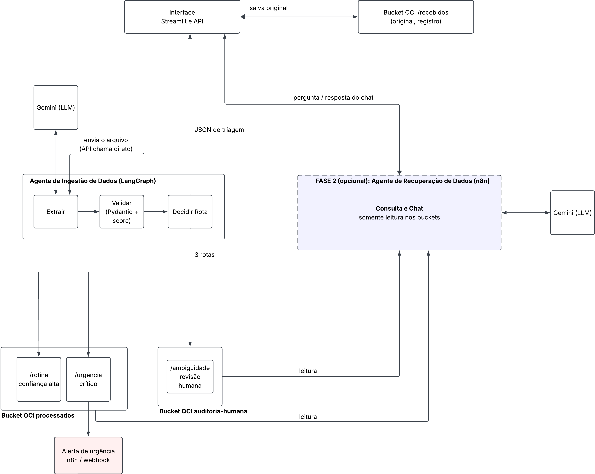
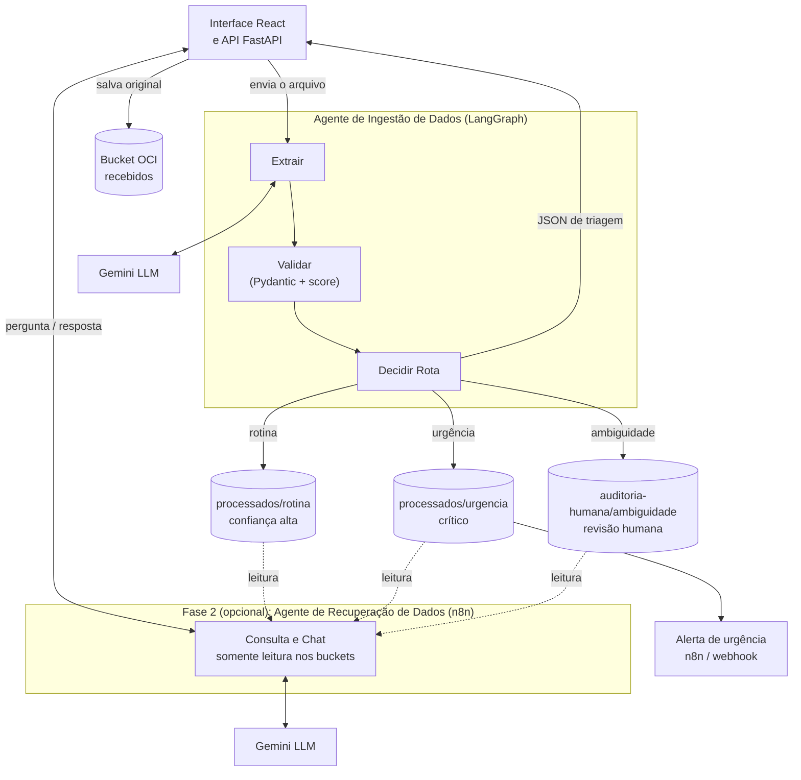

# MediFlow – G10 Equipo 7

Agente Autônomo para Triagem, Extração e Roteamento de Documentos Clínicos

Triagem automática de documentos médicos com um agente de IA. O documento entra, o agente extrai os dados, valida e decide para onde ele vai: **rotina**, **urgência** ou **ambiguidade** (revisão humana).

- **Ambiente em Produção (OCI VM):** `http://144.22.158.86:8501`

A interface chama a API, que executa extração com Gemini, validação, roteamento e gravação na OCI com `AGENT_MODE=real`, acionando o **n8n** via `ALERTA_WEBHOOK_URL` para disparo automático de alertas críticos por e-mail. A configuração e os resultados estão no [guia rápido](docs/guia-rapido.md) e na [documentação do n8n](n8n/README.md).

Triagem, chatbot, consulta, exclusão e revisão humana de documentos já se conectam à API. O React é a interface padrão no Docker; o Streamlit continua disponível no perfil opcional `legado`. Veja [como executar](frontend/README.md).

## 1. Problema e objetivo

Documentos médicos (receituários, laudos, exames) chegam em formatos variados: PDF, imagem ou texto. Tratar todos do mesmo jeito atrasa os casos críticos e deixa passar leituras duvidosas.

**Objetivo:** receber o documento, extrair as informações com um LLM, validar a saída e encaminhá-lo automaticamente, garantindo que:

- casos de rotina sejam arquivados sem intervenção;
- casos urgentes disparem um alerta;
- casos duvidosos passem por uma pessoa.

Todos os dados de teste são **fictícios**.

## 2. Arquitetura



*A Fase 2 (agente de consulta e chat, tracejada no diagrama) é opcional e não faz parte do MVP.*

A mesma arquitetura em Mermaid (editável no próprio README):


```mermaid
flowchart TD
    UI["Interface React<br/>e API FastAPI"] -->|salva original| REC[("Bucket OCI<br/>recebidos")]
    UI -->|envia o arquivo| EXT

    subgraph AGENTE["Agente de Ingestão de Dados (LangGraph)"]
        EXT[Extrair] --> VAL["Validar<br/>(Pydantic + score)"] --> ROTA[Decidir Rota]
    end

    EXT <--> GEM1[Gemini LLM]
    ROTA -->|JSON de triagem| UI

    ROTA -->|rotina| R[("processados/rotina<br/>confiança alta")]
    ROTA -->|urgência| U[("processados/urgencia<br/>crítico")]
    ROTA -->|ambiguidade| A[("auditoria-humana/ambiguidade<br/>revisão humana")]
    U --> ALERTA["Alerta de urgência<br/>n8n / webhook"]

    subgraph FASE2["Fase 2 (opcional): Agente de Recuperação de Dados (n8n)"]
        CHAT["Consulta e Chat<br/>somente leitura nos buckets"]
    end
    CHAT <--> GEM2[Gemini LLM]
    UI <-->|pergunta / resposta| CHAT
    R -.->|leitura| CHAT
    U -.->|leitura| CHAT
    A -.->|leitura| CHAT
```

### Blocos

| Bloco | Função |
|---|---|
| **Interface React e API** | Recebe PDF, imagem ou JSON; a API chama o agente e devolve o JSON de triagem. Streamlit permanece opcional. |
| **Bucket `recebidos`** | Guarda o original e serve de registro de tudo que entrou. |
| **Extrair** | Envia o documento ao Gemini e obtém os campos estruturados. |
| **Validar** | Confere a extração com os contratos Pydantic e calcula o score de confiança. |
| **Decidir Rota** | Aplica as regras de triagem e escolhe uma das 3 rotas. |
| **Bucket `processados`** | Pastas `rotina` (confiança alta) e `urgencia` (crítico). |
| **Bucket `auditoria-humana`** | Pasta `ambiguidade`, para revisão humana. |
| **Alerta de urgência (n8n)** | Recebe o JSON via webhook interno (`mediflow-net`) após gravar em `urgencia` e dispara e-mail automático via Gmail. Falhas do alerta preservam a triagem urgente. |
| **Fase 2 (opcional)** | Agente de consulta e chat com acesso somente leitura aos buckets. |

## 3. Fluxo e as 3 rotas

1. A pessoa envia o documento pela interface ou pela API.
2. O original é salvo em `recebidos`.
3. O agente executa **Extrair → Validar → Decidir Rota**.
4. O resultado é gravado na pasta da rota escolhida e o JSON de triagem volta para a interface.

| Rota | Quando | Destino | Efeito extra |
|---|---|---|---|
| **Rotina** | Documento completo, sem gravidade, confiança alta | `processados/rotina` | Nenhum |
| **Urgência** | Achado crítico no conteúdo | `processados/urgencia` | Gera a notificação e aciona o webhook configurado após salvar a triagem |
| **Ambiguidade** | Dados ilegíveis, ausentes ou confiança baixa | `auditoria-humana/ambiguidade` | Revisão humana |

Falhas técnicas persistentes após duas tentativas recebem revisão prioritária no topo da auditoria. A API registra prioridade e horário nos metadados OCI. O comportamento do retry, da fila e do alerta está no [guia da API](docs/api.md#falha-persistente-e-prioridade-de-revisão-33).

## 4. Regras de triagem

O grafo avalia **urgência → ambiguidade → rotina**, com limiar de confiança de **0,85**. Urgência com score baixo ou qualquer trava de revisão mantém a rota e exige auditoria. Alta vigilância exige revisão humana. Departamentos, evidências e gatilhos são definidos nas [regras de triagem](docs/MediFlow%20%E2%80%94%20Regras%20de%20Triagem.md), que incluem configuração e comandos para testar o grafo.


## 5. Decisões

Registro das decisões de arquitetura. Data: 19/10/2026 (fechamento da arquitetura), com atualização da decisão de infraestrutura em 11/11/2026.

| Tema | Decisão | Alternativa / observação |
|---|---|---|
| Núcleo do agente | Python com LangGraph (Extrair, Validar, Decidir Rota) | n8n fica só na Fase 2 (opcional) e nos alertas |
| Buckets | 3 buckets: `recebidos`, `processados` (pastas `rotina` e `urgencia`) e `auditoria-humana` (pasta `ambiguidade`) | Buckets oficiais provisionados e ativos na OCI, região `sa-saopaulo-1`. Integração via API compatível com S3 e Force Path Style validada |
| Gatilho de entrada | A API chama o agente diretamente | Alternativa descartada: disparar o agente por upload no bucket |
| Docker e VM (Produção) | Aplicação containerizada com Docker Compose e implantada em VM na Oracle Cloud Infrastructure (`144.22.158.86`) | Containers isolados com controle de memória (`mem_limit`), swap/zram e comunicação interna via rede Docker `mediflow-net` |
| Chaves de API | Pessoais, por variável de ambiente, nunca no código ou no chat | #3 |
| Alerta de urgência | Workflow automatizado no n8n (`Webhook -> Set -> IF -> Gmail`) com resposta HTTP controlada; a falha do alerta não derruba a triagem | Export disponível em `n8n/MediFlow - Alerta de Urgência.json` e guia de importação em `n8n/README.md` |
| Integração n8n e OCI | Leitura dos buckets OCI pelo n8n validada com sucesso | Conexão via API compatível com S3, utilizando Force Path Style. Testes de listagem e leitura de documentos realizados na Fase 2 |

**Em aberto:**

- Documento urgente e de baixa confiança: vai para auditoria humana, dispara o alerta, ou os dois? (#5)

O histórico completo fica em [`docs/decisoes.md`](https://github.com/No-Country-simulation/G10-BRASIL-equipo-7/blob/main/docs/decisoes.md).

## 6. Estrutura e como rodar

```
mediflow/
├── frontend/       # interface React/TypeScript e Nginx
├── app/            # interface Streamlit opcional
├── api/            # API FastAPI: POST /triagem (#9)
├── agent/          # grafo LangGraph, nós, contratos e regras
│   ├── nodes/      # extrair.py, validar.py, decidir_rota.py
│   ├── schemas.py  # contratos Pydantic (#1)
│   └── rules.py    # regras de triagem (#5)
├── storage/        # contrato, chaves e armazenamento nos buckets OCI (#22)
├── alerts/         # alerta de urgência (#13)
├── n8n/            # workflow JSON e documentação de configuração do n8n
├── data/sinteticos/# documentos fictícios de teste (#4)
├── docs/           # wireframes e registro de decisões
└── tests/
```

**Pré-requisitos para testar a API:** Python 3.11+ e credenciais OCI. O modo `real` também exige uma chave Gemini. Execute os comandos na raiz do projeto:

```bash
python3 -m venv .venv
source .venv/bin/activate        # Windows: .venv\Scripts\activate
python -m pip install -r requirements.txt
```

Se ainda não existir um `.env`, copie `.env.example` para `.env`. Para a demonstração com Gemini e OCI, preserve suas credenciais existentes e configure os modos abaixo.

```dotenv
AGENT_MODE=real
API_URL=http://127.0.0.1:8000
AGENT_TIMEOUT_SECONDS=30
```

Preencha a chave Gemini, as variáveis `OCI_*` e os nomes dos três buckets conforme o [guia rápido](docs/guia-rapido.md). A API lê o `.env` da raiz. Variáveis já exportadas no terminal têm prioridade. Inicie o servidor.

```bash
python -m uvicorn api.main:app --reload
```

Abra <http://127.0.0.1:8000/docs> para escolher um arquivo e testar `POST /triagem`. No modo real, o conteúdo de PDF, imagem ou JSON é enviado ao Gemini. Os exemplos de upload estão no [guia da API](docs/api.md).

Em outro terminal, com Node.js 24 LTS e npm:

```bash
cd frontend
npm ci
npm run dev
```

Abra <http://localhost:5173>. Para iniciar com Docker (local ou VM OCI), configure o `.env` (incluindo `ALERTA_WEBHOOK_URL=http://n8n:5678/webhook/<id>`) e execute `docker compose up -d --build` (local em <http://localhost:8080> ou <http://localhost:8501>; produção OCI em `http://144.22.158.86:8501`). Para importar o fluxo de alertas no n8n, siga [`n8n/README.md`](n8n/README.md).

Testes do backend, na raiz e com a venv ativa (usam armazenamento controlado):

```bash
AGENT_MODE=mock python -m pytest -q
```

Nunca commite o `.env`. Veja o `CONTRIBUTING.md` para o fluxo de branch e PR.

## 7. Cenários da demo

Três documentos fictícios, em `data/sinteticos/`, cobrem as três rotas. Envie-os pela interface com `AGENT_MODE=real`. O original vai para `mediflow-recebidos` e o resultado é salvo no bucket e prefixo da rota. As chaves combinam UUID e nome do arquivo. Na ambiguidade, uma cópia do original acompanha o resultado para revisão humana.

**Cenário 1: rotina** (`doc_teste_001_rotina.json`)

- Entrada: receituário completo de controle de hipertensão (paciente, médico com CRM e prescrição legíveis).
- A rota esperada é **rotina**, com confiança alta e resultado em `mediflow-processados/rotina`.

**Cenário 2: urgência** (`doc_teste_002_urgencia.json`)

- Entrada: laudo de tomografia com achado compatível com hemorragia subaracnoidea aguda e recomendação de avaliação neurocirúrgica imediata.
- Resultado esperado na execução real com os buckets oficiais é rota **urgência** e resultado em `mediflow-processados/urgencia`. O serviço aciona o alerta quando `ALERTA_WEBHOOK_URL` estiver configurada.

**Cenário 3: ambiguidade** (`doc_teste_003_ambiguidade.json`)

- Entrada: receituário digitalizado com baixa qualidade: nome, CRM e dose ilegíveis ("5 ou 50 mg"), diagnóstico não informado.
- A rota esperada é **ambiguidade**, com confiança baixa e resultado em `mediflow-auditoria-humana/ambiguidade` para revisão humana.

O grafo calcula o score no nó `validar` e decide a rota pelas regras configuradas. Os scores observados e as chaves dos arquivos da demonstração estão no [guia rápido](docs/guia-rapido.md).

| Arquivo | Rota | Destino principal | Bucket do resultado |
|---|---|---|---|
| `doc_teste_001_rotina.json` | `rotina` | `Farmacia_Hospitalar` | `mediflow-processados` |
| `doc_teste_002_urgencia.json` | `urgencia` | `Fila_Emergencia_Medica` | `mediflow-processados` |
| `doc_teste_003_ambiguidade.json` | `ambiguidade` | `Fila_Revisao_Humana` | `mediflow-auditoria-humana` |

## 8. Limitações e próximos passos

- Projeto de simulação, não é uso clínico: não substitui avaliação médica.
- Somente dados fictícios.
- Próximos passos: concluir o MVP, validar a Fase 2 (chat de consulta) e, como diferencial, o deploy em VM com Docker.

## Equipe

G10 Brasil – Equipo 7 (No Country).
